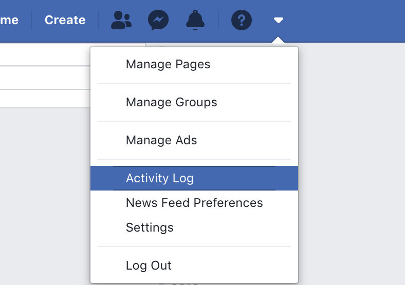
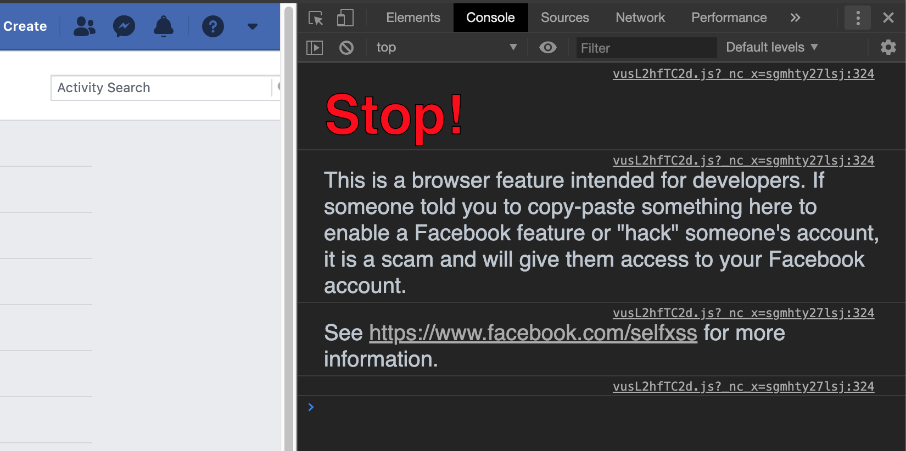
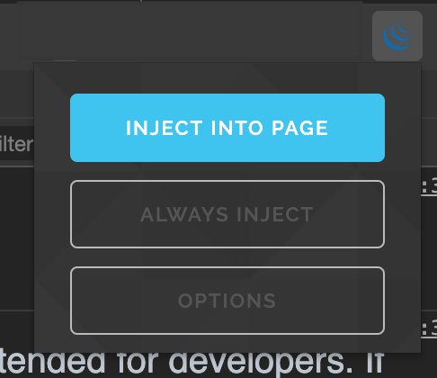
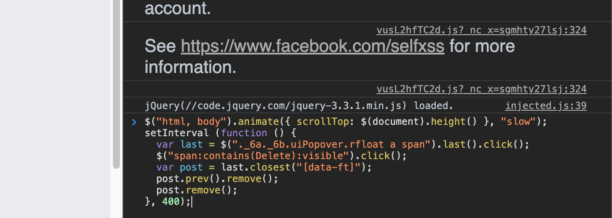

<!-- Please do not edit this file. Edit the `blah` field in the `package.json` instead. If in doubt, open an issue. -->


# reset-your-facebook-account

 [![Support me on Patreon][badge_patreon]][patreon] [![Buy me a book][badge_amazon]][amazon] [![PayPal][badge_paypal_donate]][paypal-donations] [](https://github.com/IonicaBizau/ama) [](https://www.npmjs.com/package/reset-your-facebook-account) [](https://www.npmjs.com/package/reset-your-facebook-account) [](https://www.codementor.io/johnnyb?utm_source=github&utm_medium=button&utm_term=johnnyb&utm_campaign=github)

<a href="https://www.buymeacoffee.com/H96WwChMy" target="_blank"></a>

> Sometimes you want to start your Facebook activity again. So, here are some useful scripts to delete your Facebook posts, comments and likes.

## Prerequisites

Install [this Chrome extension](https://chrome.google.com/webstore/detail/jquery-injector/ekkjohcjbjcjjifokpingdbdlfekjcgi?hl=en) or [this Firefox extension](https://addons.mozilla.org/en-US/firefox/addon/greasemonkey) to include jQuery on the page.

Replace `your-facebook-username` in URLs with your Facebook username. Then start hacking. :smile:

## Instructions

### Go to Activity Log on Facebook

You can either click on the links in each of the categories listed below (Likes, Posts, Comments etc.) or navigate to the Activity Log yourself: 



Go to Facebook > Click on the carret on the right side of the navigation bar > Select Activity Log > Select the category you'd like to delete.

> If you'd like to filter by year, add `&year=2015` at the end of the URL. This way you'll only delete items from that year.

### Open Developer tools

Right click anywhere on the screen and select **Inspect element**.

When a new window pops up somewhere on your screen, click on the **Console** tab.

You'll be greeted with a scary Facebook message, but just ignore it.



### Inject jQuery

If you've followed [Prerequisites](#Prerequisites), then you have the jQuery extension installed.

Click on the extension icon and select **Inject into page**:



If everything went well, you should see something like this printed at the bottom of the console:

	jQuery(//code.jquery.com/jquery-3.3.1.min.js) loaded.

### Copy/paste the code snippet

Copy one of the code snippets listed below and paste it into the console, just below "JQuery ... loaded" line:



Then click enter and let the magic begin. :)

> In-between the Facebook page might reload so you'll need to repeat the process (injecting jQuery and pasting the code again).

## Likes

> https://www.facebook.com/your-facebook-username/allactivity?privacy_source=activity_log&log_filter=likes

```js
$("html, body").animate({ scrollTop: $(document).height() }, "slow");
setInterval(function () {
  var last = $("._6a._6b.uiPopover.rfloat a span").last().click();
  $("span:contains(Unlike):visible").click();
  var post = last.closest(".pam");
  post.prev().remove();
  post.remove();
}, 700);
```

## Posts

> https://www.facebook.com/your-facebook-username/allactivity?privacy_source=activity_log&log_filter=cluster_11

```js
$("html, body").animate({ scrollTop: $(document).height() }, "slow");
setInterval (function () {
  var last = $("._6a._6b.uiPopover.rfloat a span").last().click();
  $("span:contains(Delete):visible").click();
  setTimeout(function () {
    $("button:contains(Delete Post):visible").click();
    setTimeout(function () {
        $("button:contains(Delete):visible").click();
    }, 2000);
    last.closest("table").remove();
  }, 1000);
}, 7000);
```

## Comments

> https://www.facebook.com/your-facebook-username/allactivity?privacy_source=activity_log&log_filter=cluster_116

```js
$("html, body").animate({ scrollTop: $(document).height() }, "slow");
setInterval (function () {
  var last = $("._6a._6b.uiPopover.rfloat a span").last().click();
  $("span:contains(Delete):visible").click();
  var post = last.closest("[data-ft]");
  post.prev().remove();
  post.remove();
}, 400);
```

In 2017 Facebook introduced mentions of you in comments from others which are listed among your own comments in the Activity Log (which is dumb, but what can you do). Here's a quick and dirty workaround:

```js
let counter = 0;

$("html, body").animate({ scrollTop: $(document).height() }, "slow");
setInterval (function () {
  var last = $("._6a._6b.uiPopover.rfloat a span").last().click();
  
  if (counter < 20) {
    counter++;
    $("span:contains(Delete):visible").click();
    var post = last.closest("[data-ft]");
    post.prev().remove();
    post.remove();
  } else {
    var post = last.closest("tbody");
    post.prev().remove();
    post.remove();
    counter = 0;
  }
}, 400);
```

The workaround might miss some of the comments that should be deleted, so make sure that you check the comments list again to either manually delete the missed comments or to run the script again.

## Delete messages

```js
var i = setInterval(function () {
  $ul = $("#wmMasterViewThreadlist")
  if (!$ul.find("li").length) return clearInterval(i);
  $ul.find("li").last().find("span").click()
  $("button:contains('Actions')").click()
  $("span:contains('Delete Conversation...')").click()
  $("input[value='Delete Conversation']").click()
}, 500);
```

## Clear timeline

> https://www.facebook.com/your-facebook-username/allactivity?privacy_source=activity_log&log_filter=all

```js
setInterval (function () {
  $("html, body").animate({ scrollTop: $(document).height() }, "slow");
  $('*[aria-label="Hidden from Timeline"]').each(function () {
    $(this).parents('.bottomborder').remove();
  });
  var allowed = $('*[aria-label="Allowed on Timeline"] span').last();
  allowed.click();
  $('.uiContextualLayer').find('li:nth-child(2)').find('a span').click();
  allowed.parents('.bottomborder').remove();
}, 400);
```


## :yum: How to contribute
Have an idea? Found a bug? See [how to contribute][contributing].


## :sparkling_heart: Support my projects

I open-source almost everything I can, and I try to reply to everyone needing help using these projects. Obviously,
this takes time. You can integrate and use these projects in your applications *for free*! You can even change the source code and redistribute (even resell it).

However, if you get some profit from this or just want to encourage me to continue creating stuff, there are few ways you can do it:


 - Starring and sharing the projects you like :rocket:
 - [![Buy me a book][badge_amazon]][amazon]—I love books! I will remember you after years if you buy me one. :grin: :book:
 - [![PayPal][badge_paypal]][paypal-donations]—You can make one-time donations via PayPal. I'll probably buy a ~~coffee~~ tea. :tea:
 - [![Support me on Patreon][badge_patreon]][patreon]—Set up a recurring monthly donation and you will get interesting news about what I'm doing (things that I don't share with everyone).
 - **Bitcoin**—You can send me bitcoins at this address (or scanning the code below): `1P9BRsmazNQcuyTxEqveUsnf5CERdq35V6`

    


Thanks! :heart:


## :scroll: License

[MIT][license] © [Ionică Bizău][website]


[badge_patreon]: https://ionicabizau.github.io/badges/patreon.svg
[badge_amazon]: https://ionicabizau.github.io/badges/amazon.svg
[badge_paypal]: https://ionicabizau.github.io/badges/paypal.svg
[badge_paypal_donate]: https://ionicabizau.github.io/badges/paypal_donate.svg

[patreon]: https://www.patreon.com/ionicabizau
[amazon]: http://amzn.eu/hRo9sIZ
[paypal-donations]: https://www.paypal.com/cgi-bin/webscr?cmd=_s-xclick&hosted_button_id=RVXDDLKKLQRJW

[license]: http://showalicense.com/?fullname=Ionic%C4%83%20Biz%C4%83u%20%3Cbizauionica%40gmail.com%3E%20(https%3A%2F%2Fionicabizau.net)&year=2014#license-mit
[website]: https://ionicabizau.net
[contributing]: /CONTRIBUTING.md
[docs]: /DOCUMENTATION.md
